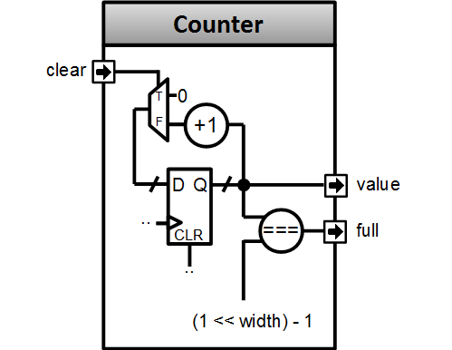

## Introduction
The goal of this lab is to get basics of SpinalHDL by implementing a simple component which increment its output `value` each cycle and provide a `full` flag.

This lab will introduce :

- Component with it IO definition and a little parameterization
- Combinatorial and Sequential logic (gates and register)
- Conditional statements (when)

## Component interfaces

| name | direction | type | description |
| ------ | ----------- | ------ |  ------ |
| clear | in | Bool | When set, the internal register is cleared |
| value | out | UInt(width bits) | By default, count up each cycle. Initialized to zero. Can overflow.|
| full | out | Bool | Indicate when all bits of the output `value` are True. |

## RTL parametrization

| name | type | description |
| ------ | ----------- | ------ |
| width | Int | Specify the width of the `value` output |

## Tips

There is a SpinalHDL documentation and many examples [there](http://spinalhdl.github.io/SpinalDoc/)
