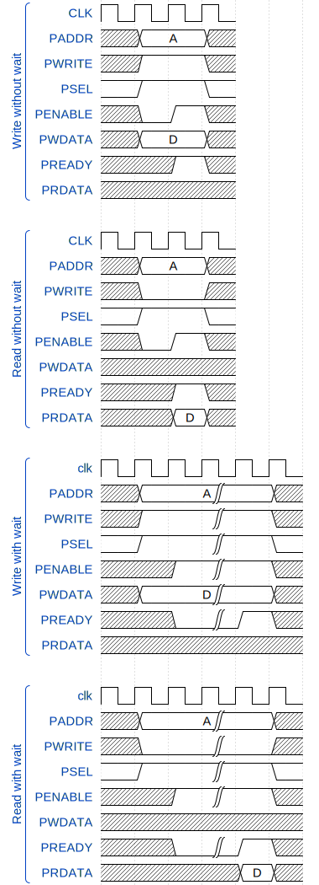

## Introduction
To goal of this lab is to get a little bit more into SpinalHDL by understanding how you can organise things. 
The Component to implement is an PWM generator which is controllable mapped on a APB bus.

This lab will introduce :
- Data structure and  buses (Bundle)
- Conditional statments (switch)
- Functionality groups (Area)

## Component interfaces

| name | direction | type | description |
| ------ | ----------- | ------ | ------ |
| apb | slave | APB | Bus used to read and write internal registers |
| pwm | out | Bool | PWM output of the component |

## Register mapping

| name | type | address |  description |
| ------ | ------ | ----------- | ------ |
| enable | R/W | 0 | Enable the internal timer when the register LSB is set |
| dutyCycle | R/W | 4 | Specify own many cycle the `pwm` output is high in a timer period.   Range from 0 to (1 << timerWidth)-1 |

## RTL parametrization

| name | type | description |
| ------ | ----------- | ------ |
| apbConfig | ApbConfig | Specify the shape of the APB bus |
| timerWidth | Int | Specify how many bits the internal timer has |

## APB specification
For they labs, you don't need to insert wait cycle on the bus, so you can keep the PREADY always high.

