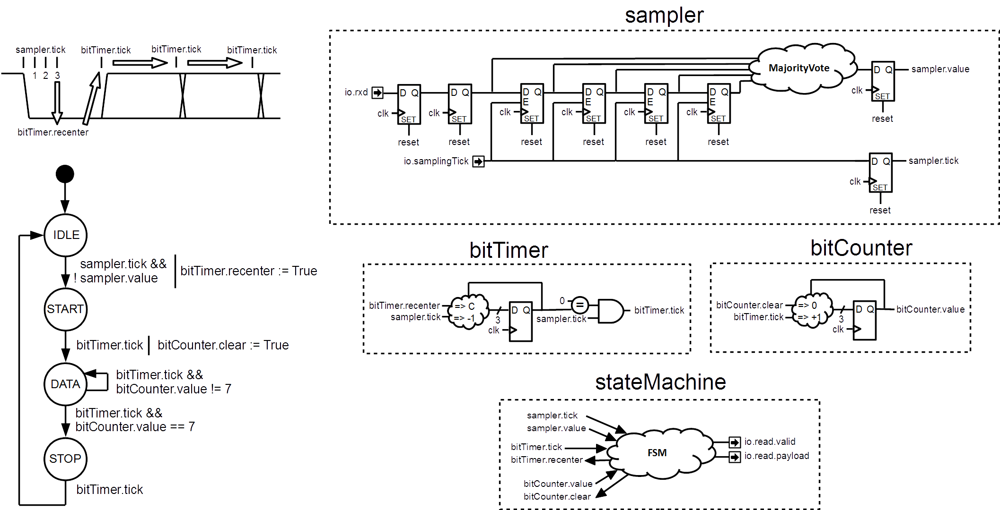

## Description
Component that translate UART frame into a flow of bytes.
UART baud are filtered by using a sliding window of `samplingSize` samples. This window is also centred  in the UART baud by using `preSamplingSize` and `postSamplingSize` constants.

## Component interfaces

| name | direction | type | description |
| ------ | ----------- | ------ | ------ |
| rxd | in | Bool | Pin used to receive UART frames |
| samplingTick | in | Bool | Time reference used to sample `rxd`   Tick `preSamplingSize + samplingSize + postSamplingSize` time per uart baud  | 
| read | master | Flow(Bits(8 bits)) | Flow used to transmit decoded bytes |

## RTL parametrization

All RTL parameters are contained into the `UartRxGenerics` class. This class contain following parameters :

| name | type | description | 
| ------ | ----------- | ------ |
| preSamplingSize | Int | Specify how many samplingTick are drop at the beginning of a UART baud |
| samplingSize | Int | Specify how many samplingTick are used to sample `rxd` values in the middle of the UART baud  |
| postSamplingSize | Int | Specify how many samplingTick are drop at the end of a UART baud  |

## RTL diagram

This module is divided in 4 Area :

- sampler : Which implement the UART baud filter
- bitTimer : Which could be configured by the FSM to provide a tick on each end of UART baud.
- bitCounter : Which is a simple clearable counter.
- stateMachine : Which manage all this stuff together.

